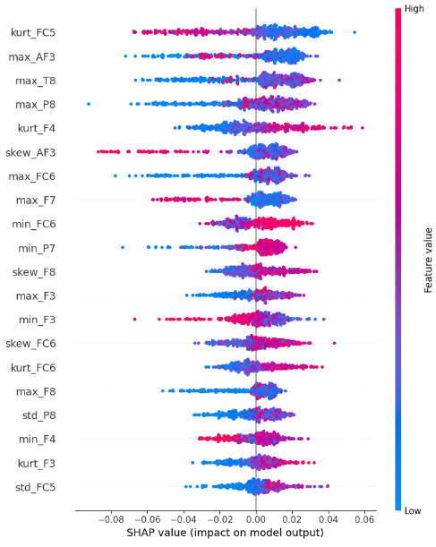

# eeg-eye-state-classification
EEG eye-state classification using LSTM, Random Forest, and a custom Transformer architecture with SHAP interpretability analysis

## Overview
This project builds an EEG eye-state classification pipeline on the UCI 
EEG Eye State dataset, comparing Random Forest models across four feature 
representations against an LSTM and a custom Transformer on raw EEG. Key finding: statistical 
time-domain features outperform spectral features, and the transformer achieves the 
best overall performance (0.74 ROC-AUC), suggesting attention over raw temporal windows
captures discriminative structure that handcrafted features may miss.

## Results
| Model | Features | ROC-AUC | Std |
|-------|----------|---------|-----|
| Random Forest | FFT Bandpower | 0.52 | 0.065 |
| Random Forest | Alpha/Beta Ratio | 0.46 | 0.058 |
| Random Forest | Combined | 0.59 | 0.039 |
| Random Forest | Statistical | 0.62 | 0.028 |
| LSTM | Raw EEG | 0.68 | 0.082 |
| Transformer | Raw EEG (windowed) | 0.74 | 0.137 |

## Key Finding
SHAP analysis revealed that classification is driven primarily by 
oculomotor artifacts at frontal electrodes rather than occipital alpha 
rhythm suppression — suggesting consumer-grade EEG hardware cannot 
reliably capture the alpha-blocking phenomenon with sufficient SNR.

## Transformer Experiment
Initial experiments using standard Blocked Cross-Validation yielded an inflated ROC-AUC of 0.81 due to severe class imbalances in the sequential splits (e.g., a 77:11 class ratio in the final fold).

To enforce strict methodological rigor, the validation strategy was updated to **5-fold Stratified Group K-Fold (SGKF)**. Windows were grouped into contiguous macro-blocks to prevent overlap leakage, while SGKF ensured a representative balance of eyes-open and eyes-closed states across all folds.

An automated Bayesian hyperparameter search using Optuna (Tree-structured Parzen Estimator) was conducted to find an architecture that prevents overfitting on the small post-artifact dataset.

The optimized architecture is a 2-layer Transformer with 16-dimensional embeddings and 4 attention heads, trained via AdamW (lr ~2.26e-5, weight decay ~0.027). It utilizes RoPE positional encoding, label smoothing (0.1), and early stopping monitored via an Exponential Moving Average (EMA) of the validation loss.

Under this rigorous validation framework, the model achieved a robust mean ROC-AUC of **0.74 ± 0.137**, outperforming both the LSTM (0.68) and Random Forest (0.62) baselines. The high fold variance reflects the inherent non-stationarity of the EEG recordings across different temporal segments.

## Pipeline
- Data loading (117 seconds, 14 channels, 14980 samples)
- Sliding windows segmentation (window = 128 samples, stride = 32) with per-window mean subtraction to remove DC drift
- Artifact rejection (threshold = 150uV)
- Blocked cross-validation to prevent model from training on data temporally adjacent to test data and inflate performance
- 5-fold division, each fold serving as test set once while remaining folds form training set
- StandardScaler fitted on training data only per fold
- SHAP Analysis applied to best-performing Random Forest
- Optuna Bayesian search implemented for Transformer hyperparameter tuning to restrict model capacity and optimize regularization.

## Requirements
- Python 3.8+
- numpy
- pandas
- torch
- scikit-learn
- scipy
- shap

## Usage
Download EEG Eye State.arff from the UCI repository and place it in the 
same directory as the script. Then run:
EEGEyeState.py

## Paper
Full research paper included in this repository as EEG_Paper.pdf

